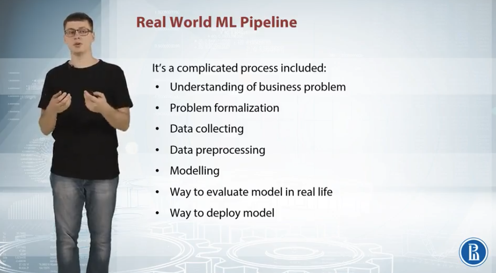
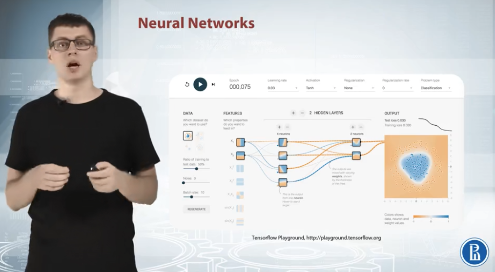
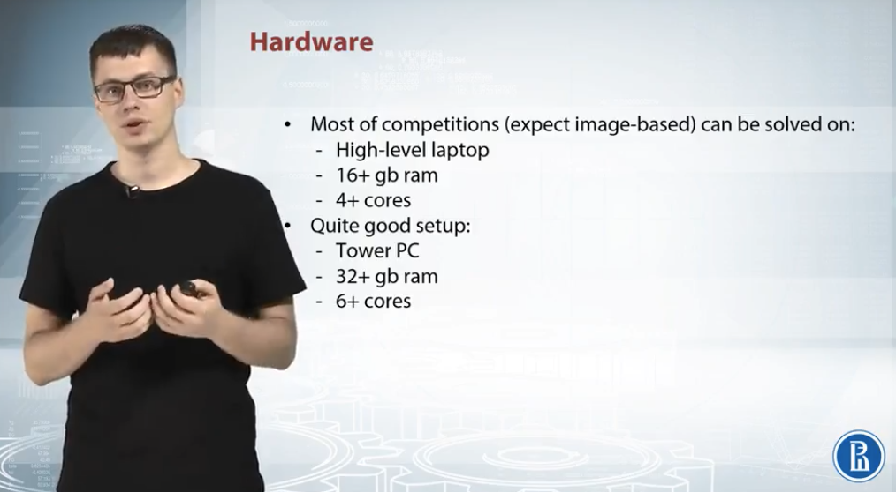

# Week 1

## 1 Competition Overview

### 1.1 Competition Mechanics

+ Data
+ Model
+ Submission
+ Evaluation
+ Leaderboard

  

### 1.2 ML Pipelines

#### 1.2.1 Real world ML pipeline

  

#### 1.2.2 Competition ML pipeline

  

#### 1.2.2 Things we need to care about

  

## 2 ML Recap

### 2.1 Linear

+ **Examples**: Logistic regession / SVM (linear models with different loss functions)
+ **Good**: Sparse high dimensional data
+ **Limitation**: Too simple
+ **Libraries**: sklearn, vowpal wabbit

  
  

### 2.2 Tree-based

+ **Idea**: Divide and conquer
+ **Examples**: Random forst and gradient boosted decision trees
+ **Good**: Tabular data
+ **Limitation**: Linear dependencies (requires a lot of splits)
+ **Libraries**: sklearn, XGBoost, LightGBM(Github)

  
  

### 2.3 kNN

+ **Idea**: Closer objects are likely to have same labels (square distances)
+ **Good**: Informative
+ **Libraries**: sklearn

  

### 2.4 Neural Network

+ **Idea**: Produce a smooth separating curve in constrast to decision trees
+ **Good**: Images, sounds, texts, and sequences
+ **Libraries**: TensorFlow, mxnet, PyTorch, Lasagne

  

## 3 Hardware & Software

### 3.1 Hardware

  

### 3.2 Software

#### 3.2.1 Basic stack

+ NumPy: Linear algebra library to work with **dimensional arrays**
+ NumPy: Provide fast and flexible way to work with a **relational table of data**
+ Scikit-learn: Classic machine learning algorithms
+ Matplotlib: **Visualizations**

#### 3.2.2 Special pakcages

+ XGBoost, LightGBM(Github): gradient-boosted decision trees
+ Keras: Neural nets
+ TSNE

#### 3.2.3 External tools

+ Vowpal wabbit: Provide blazing speed when handling really large datasets
+ Libfm(Github), libffm(Github): Implement different types of optimization machines; often used for sparse data like click-through rate prediction
+ Fast_rgf(Github): alternative based method to use in ensembles
