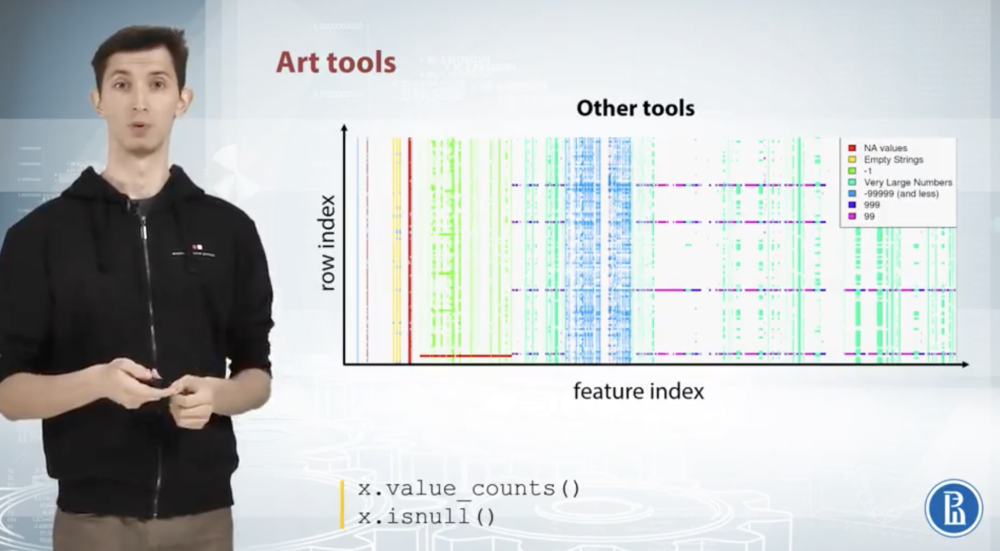

# Week 2

## 1 EDA

**Purpose**
+ Get comfortable with the data
+ Find magic features

### 1.1 Procedure

Example: Predict advertiser's cost

#### 1.1.1 Getting domain Knowledge

  

#### 1.1.2 Checking if the data is intuitive

+ Left: Typo -> It might be 36, so we just manually correct that
+ RightL Algorithm? -> Might be a algorithm problem (algorithmn that generates the dataset), and need to be investigated further -> Create a new feature called `is_incorrect`

  
  

#### 1.1.3 Understanding how the data is generated

Plot both train and test sets -> Match train set to test set

  

### 1.2 Exploring Anonymized Data

#### 1.2.1 Explore individual features

+ Columns -> Meaning / Types
+ Example: x1 & x6 might hash values

  

#### 1.2.2 Try to decode the features

Example

[Notebook link](https://github.com/yixiaowang2001/Kaggle_Notes/blob/main/res/notebooks/EDA_anonymous.ipynb)

  

#### 1.2.3 Types of features

  

### 1.3 Visualization

#### 1.3.1 Explore individual features

+ Histograms
+ Plots
+ Statistics

##### 1.3.1.1 Histogram

+ Left: without log; right: with log -> never make conclusions based on one plot
+ Right: Peak: might be missing value

  
  

##### 1.3.1.2 Plots

+ Left: horizontal line -> repeated values
+ Left: horizontal line but no vertical line -> values are all randomly shuffled
+ Right: by group(color) -> data is not fully shuffled here, sorted by class label

  
  

##### 1.3.1.3 Feature Statistics

+ Right: help find missing values

  
  

#### 1.3.2 Explore feature relations

+ Scatter plot
+ Correlation plot
+ Plot (index vs. feature statistics)

##### 1.3.2.1 Scatter plot

+ Left: relationship between two features -> classification task, colors of points are the groups; regressiion task, heat map light coloring / values can be reflected by point sizes

  
  

