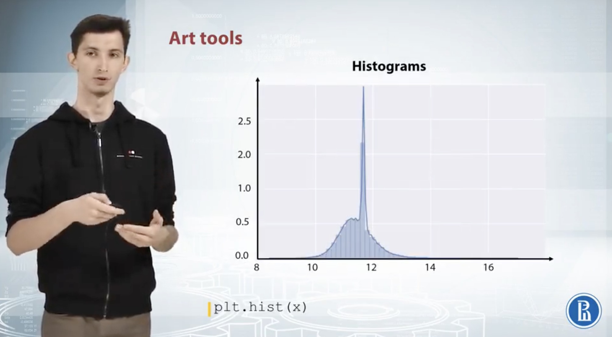
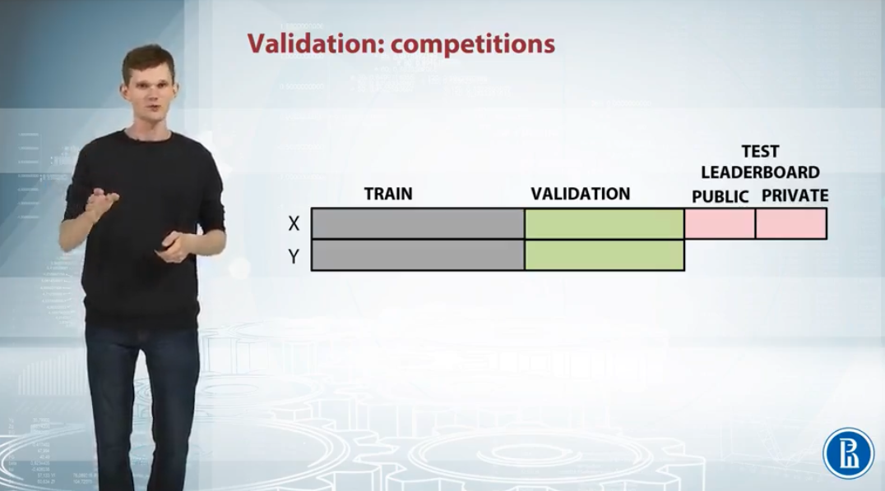
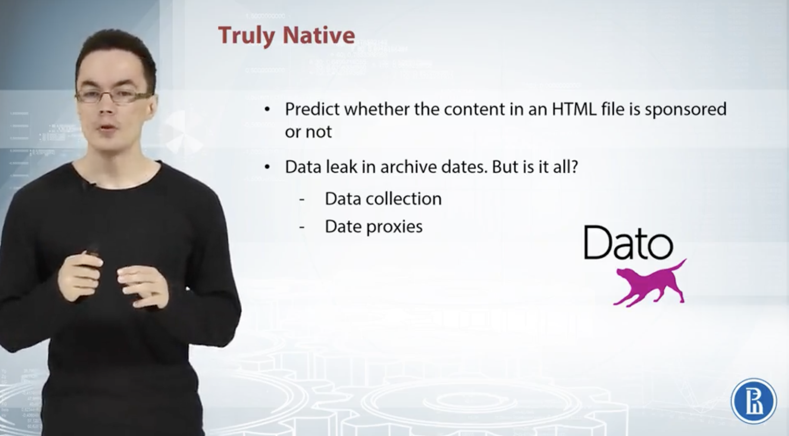

# Week 2

## 1 EDA

**Purpose**
+ Get comfortable with the data
+ Find magic features

### 1.1 Procedure

Example: Predict advertiser's cost

#### 1.1.1 Getting domain Knowledge

  

#### 1.1.2 Checking if the data is intuitive

+ Left: Typo -> It might be 36, so we just manually correct that
+ RightL Algorithm? -> Might be a algorithm problem (algorithmn that generates the dataset), and need to be investigated further -> Create a new feature called `is_incorrect`

  
  

#### 1.1.3 Understanding how the data is generated

Plot both train and test sets -> Match train set to test set

  

### 1.2 Exploring Anonymized Data

#### 1.2.1 Explore individual features

+ Columns -> Meaning / Types
+ Example: x1 & x6 might hash values

  

#### 1.2.2 Try to decode the features (Example)

[Notebook link](https://github.com/yixiaowang2001/Kaggle_Notes/blob/main/res/notebooks/EDA_anonymous.ipynb)

  

#### 1.2.3 Types of features

  

### 1.3 Visualization

#### 1.3.1 Explore individual features

+ Histograms
+ Plots
+ Statistics

##### 1.3.1.1 Histogram

+ Left: without log; right: with log -> never make conclusions based on one plot
+ Right: Peak: might be missing value

  
  

##### 1.3.1.2 Plots

+ Left: horizontal line -> repeated values
+ Left: horizontal line but no vertical line -> values are all randomly shuffled
+ Right: by group(color) -> data is not fully shuffled here, sorted by class label

  
  

##### 1.3.1.3 Feature Statistics

+ Right: help find missing values

  
  

#### 1.3.2 Explore feature relations

+ Scatter plot
+ Correlation plot
+ Plot (index vs. feature statistics)

##### 1.3.2.1 Scatter plot

+ Left: relationship between two features -> classification task, colors of points are the groups; regressiion task, heat map light coloring / values can be reflected by point sizes
+ Right: distributions of train and test sets data —> if you see some kind of discrepancy between colored and gray points distribution -> bug/overfitting (not healthy)

  
  

##### 1.3.2.2 Plot (index vs. feature statistics)

+ Left: relationship between x2 and x1? -> x2 <= 1 - x1
+ Right: goal is feature generation -> make a feature to each triangle in given points belong

  
  

Small data: 

  

##### 1.3.2.3 Correlation plot

+ Left: before clustering: if the plot look like a mess here, we can run some kind of clustering like K-means clustering on the rows and columns of this matrix and reorder the features
+ Right: after clustering

  
  

##### 1.3.2.4 Other plots

+ Left: plot (feature index vs. feature mean)
+ Right: plot after sorting feature mean

  

### 1.4 Dataset Cleaning

#### 1.4.1 Dataset Cleaning

##### 1.4.1.1 Duplicated and constant features

+ Left: feature that has same value in both train and test set -> REMOVE
+ Right: feature that has same value in train set, but different value in test set -> REMOVE: Linear model will assign some weight to the feature, but the weight is totally unreliable to the new values of that feature
+ If the feature is not constant in train set, but constant in test set -> Do the new value matter much or not?: come up with a validation set, compared the model outcome with the same feature value, or the new feature values -> REMOVE or CREATE a separate model for the object with new feature values

  
  

+ Left: numerical features of duplicated columns
+ Right: categorical features of duplicated columns but with disordered notation ([A, B, C] -> [B, C, A])

  
  

##### 1.4.1.2 Duplicated rows

+ Duplicated row (and check if train and test sets hava the same row -> set label for the test row that are present in the trian set)

  

#### 1.4.2 Check if the dataset is shuffled

+ Not shuffled -> high chance to find data leakage
+ Plug a feature or target vector vs. row index (optionally smooth the values using running average) -> if the data is shuffled properly, we can see the value is oscillating around the average

  

### 1.5 EDA Check List

  

### 1.6 EDA Example

#### 1.6.1 Springleaf

[Notebook link](https://github.com/yixiaowang2001/Kaggle_Notes/blob/main/res/notebooks/EDA_springleaf.ipynb)

  

#### 1.6.2 Numerai competition

  

##### 1.6.2.1 Data leakage

  

##### 1.6.2.2 Hardcore EDA

Start with correlated features

  

##### 1.6.2.3 Relationship between different weeks of data

  

### 1.5 Validation and Overfitting

#### 1.5.1 Competition data structure

Train, validation, and test sets

  

#### 1.5.2 Underfitting and overfitting

+ Underfitting: not capturing enough patterns in the data
+ Overfitting: capturing noize; capturing patterns which do not generalize to test data

Training error is better than test error -> overfitting is better than underfitting in a general sense

  
  

#### 1.5.3 Valiation startegies

##### 1.5.3.1 Holdout

  

##### 1.5.3.2 K-fold

Difference between K-fold and use holdout for k times: some sample might not be validation in holdout version (overlap)

  

##### 1.5.3.2 Leave-one-out

+ Special case when K-fold = k -> leave-one-out
+ Effective when the data is too small

  

#### 1.5.3 Stratification

+ Get similar distribution over different folds
+ It is useful for:
  + Small datasets
  + Unbalanced datasets
  + Multiclass classification

  

### 1.6 Data Splitting Strategies

#### 1.6.1 Different approaches to validaiton

Example: use current data to predict next week's sales data
+ Two different split startegy will lead to totally different outcome; the best model of the first type of validation split won't be the best one of the second

  

In the second case, validation score will be closer to the test score

  

#### 1.6.2 Splitting data into train and validation

+ Random, rowwise
+ Timewise: special case -> moving window
+ By id: distinguish train and test data

  
  

#### 1.6.3 Problems occuring during validation 

##### 1.6.3.1 Different scores for different folds

Causes of different scores and optimal parameters
1. Too little data: train data is so small that the model cannot generalize all features properly -> different data different features -> different scores
2. Too diverse and inconsistent data

We should do extensive validation
1. Average scores from different KFold splits
2. Tune model on one split, evaluate score on the other

##### 1.6.3.2 Submission stage

  

Different distributions: 

**Example 1**
+ Distributions of heights for man and woman
+ Train (woman) and test (man)

Solutions:
1. Mean for train -> calculate from the train data
2. Mean for test (literal probing)
  1. If the competition's evaluation metric is s.d., we can send to constant submissions write down simple formula
  2. Find out that the average targe value for the test is xxxx
3. Know the difference -> add the value to all predictions

  

**Example 2**
+ Trian consist both men and women
+ Test consist both men and women

Solutions:
1. Mimic the train test split: if test consist most of the men, force the validation to have the same distribution

  

##### 1.6.3.2 Conclusion

  

### 1.7 Data Leakages

#### 1.7.1 Data leaks in time series

+ Check train/public/private splits -> If one of them is not on time -> data leak
+ In this case, unrealistic features like "Price next week" will be the most important

  

#### 1.7.2 Unexpected information

+ Meta data: like information stored inside the picture file -> time created, location, camera, etc.
+ ID: sometimes not generated by machine -> might be some hash values
+ Row order: in some rare cases, row closer to each others may have the same label

  

#### 1.7.3 LB data leak probing

  

##### 1.7.3.1 Truly native

  

##### 1.7.3.2 Expedia

  

##### 1.7.3.3 Flavours of physics

  

##### 1.7.3.4 Pairwise tasks

  

#### 1.7.4 Data leak example

  

