# Week 3

## 1 Regression Metrics

+ MSE, RMSE, R-squared
+ MAE
+ (R)MSPE, MAPE
+ (R)MSLE

### 1.1 MSE, RMSE, R-squared

#### 1.1.1 MSE and RMSE

  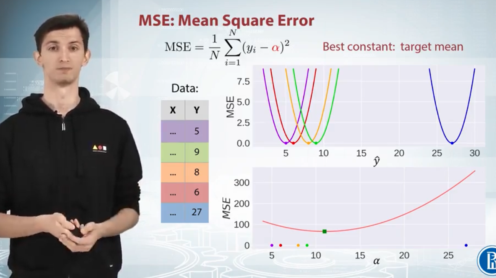

+ RMSE and MSE are very similar, but they can not be immediately interchangeable for gradient based methods (need to adjust parameters, like learning rate)
+ RMSE or MSE cannot use to evaluate a model only by looking at its value -> use R2

  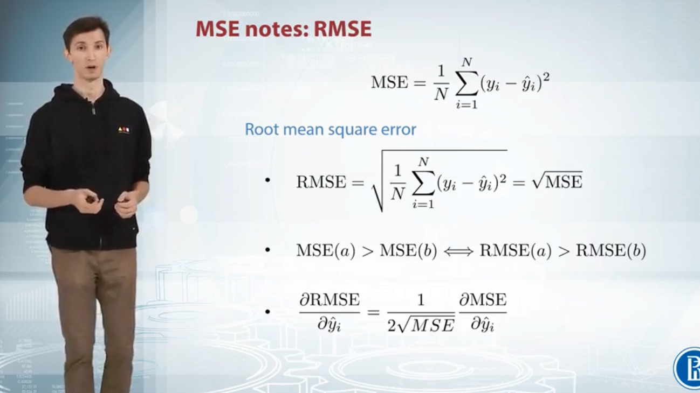

#### 1.1.2 R2

+ Optimizing MSE is equivalent to optimizing R2
+ R2 is MSE score divided by a constant and substracted another constant

  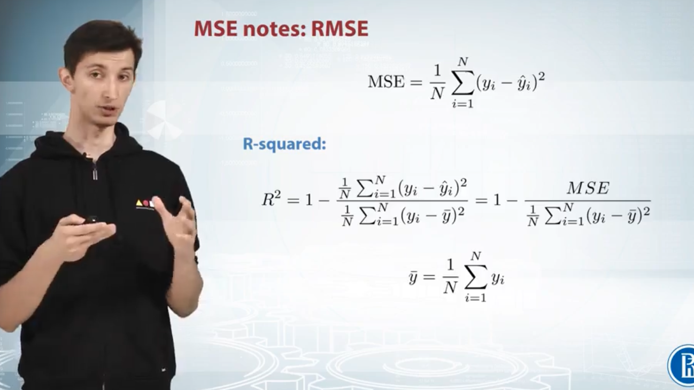

### 1.2 MAE

+ Not that sensetive compared to MSE
+ Widely used in financial area ($10 error is usually exactly two times worse than $5 error)

  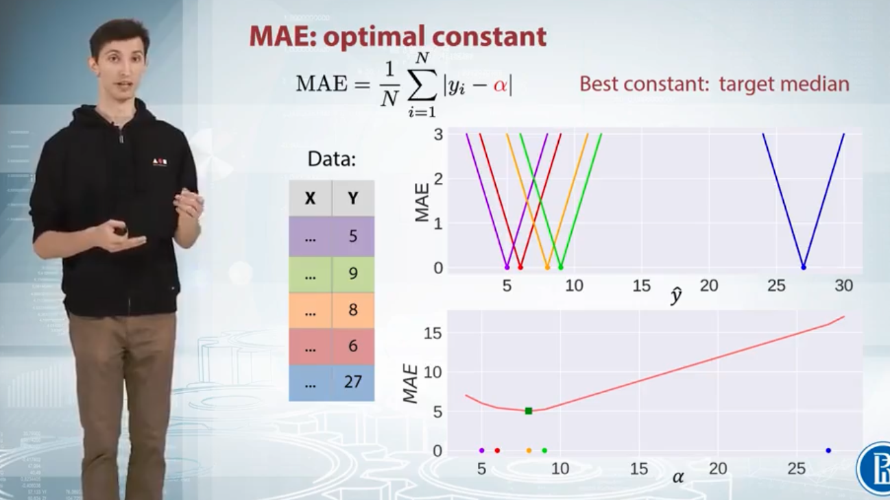

### 1.3 MSE vs. MAE

  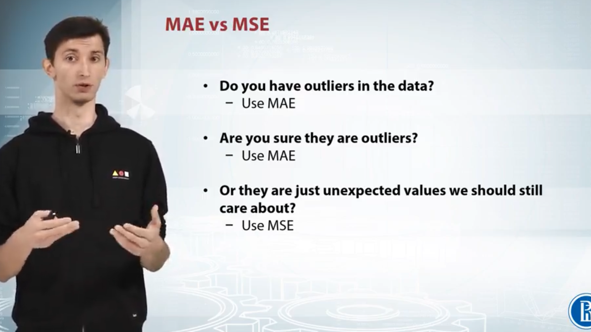

### 1.4 MSPE and MAPE

+ MSE and MAE can not reflect the data well in this case
+ MAPE and MSPE are basically MAE and MSE with weighted
+ Curve become more flat

  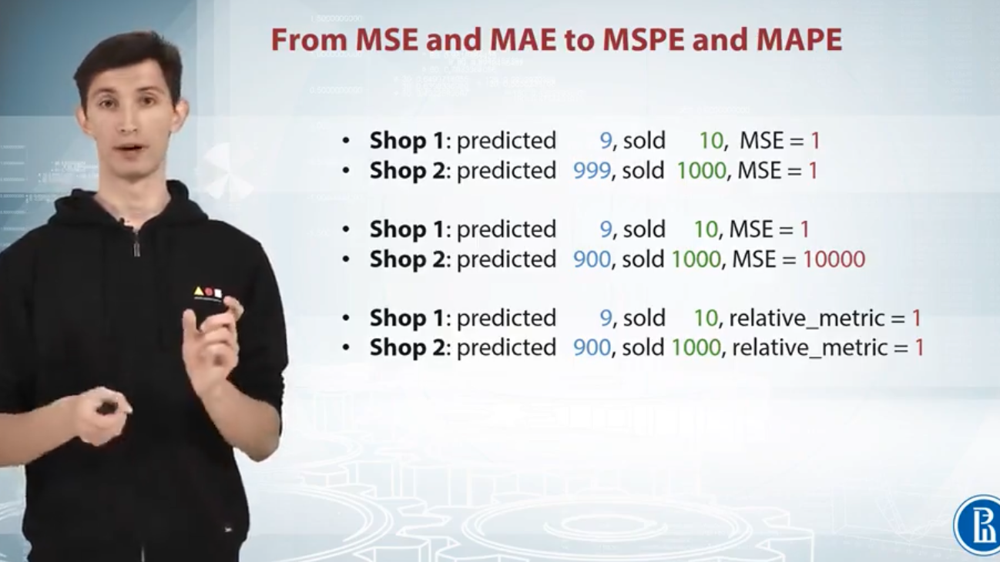
  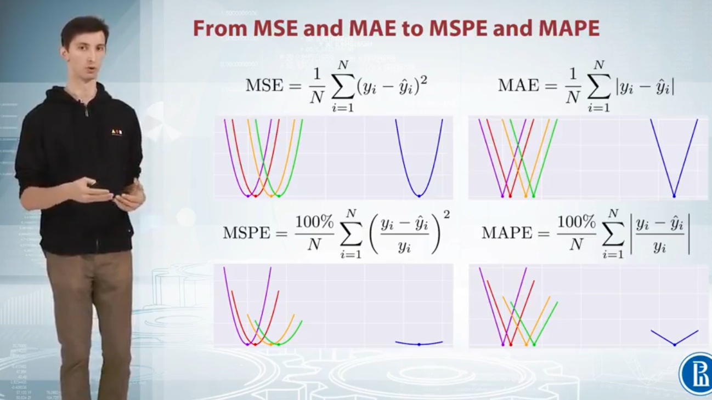

### 1.5 (R)MSLE

+ (R)MSLE - MSE in log space
+ Use same as MSPE and MAPE
+ Relative errors more compared the absolute errors
+ Assymetry error curve: better to predict more than target value

  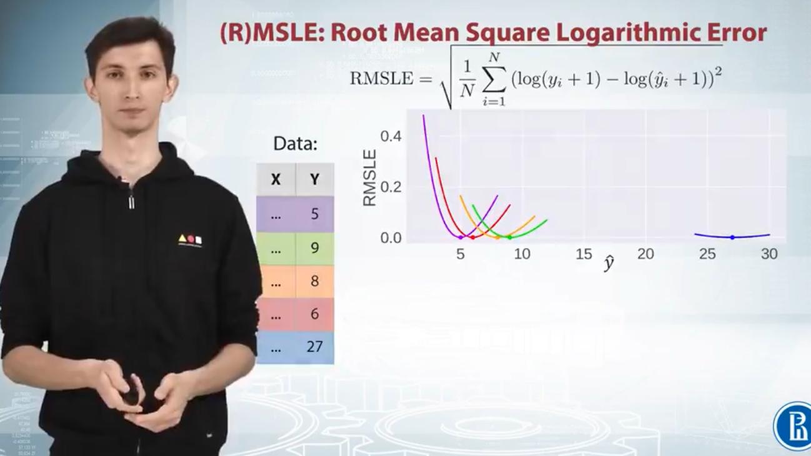

### 1.6 Summary

+ RMSLE > MAPE / MSPE
+ MAPE and MSPE have strong bias to smaller values

  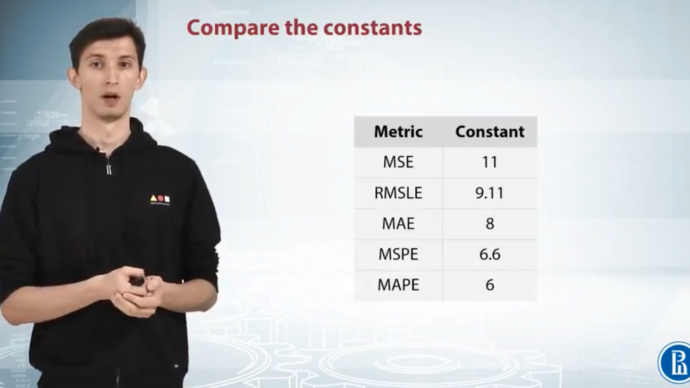

## 2 Classification Metrics

### 2.1 Notations

  

### 2.2 Accuracy score

+ Need hard predictions
+ Baseline could be very high

  

### 2.3 Logloss

For multi-classes, if the number of classes is two -> binary case

  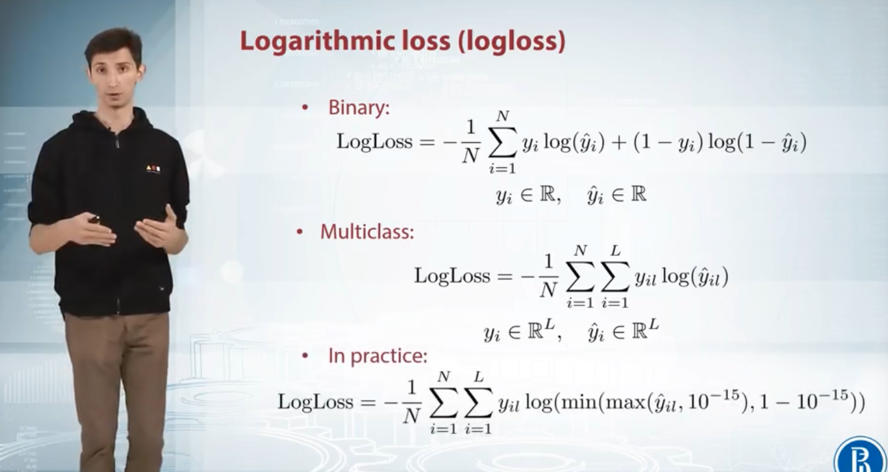

### 2.4 AUC, ROC

+ How to calculate area:
  1. Start with the bottom left one
  2. Go right when meets a red dot
  3. Go left when meets a green dot
+ Does not depend on the abosluate values, but ordering of objects
+ Transfer soft to hard labels -> removes the dependence of the score on threshold

  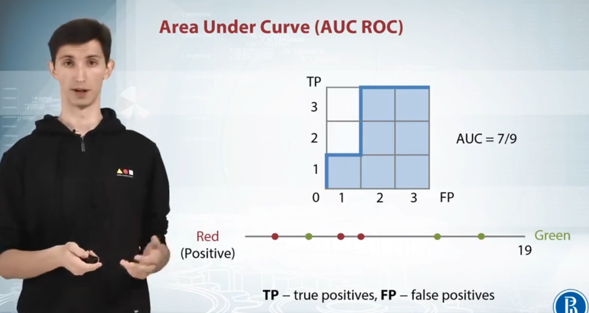

+ Dot line: how is the curve if our predictions are randomly generated
+ Basicline: 0.5

  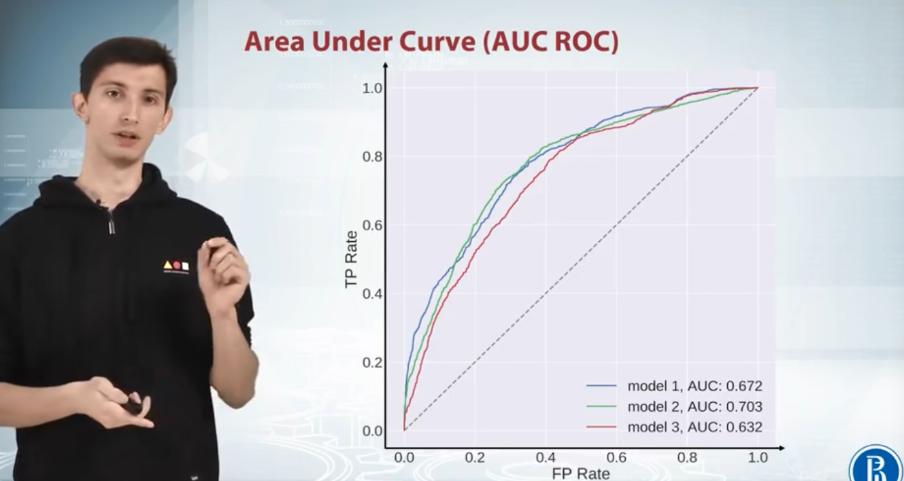
  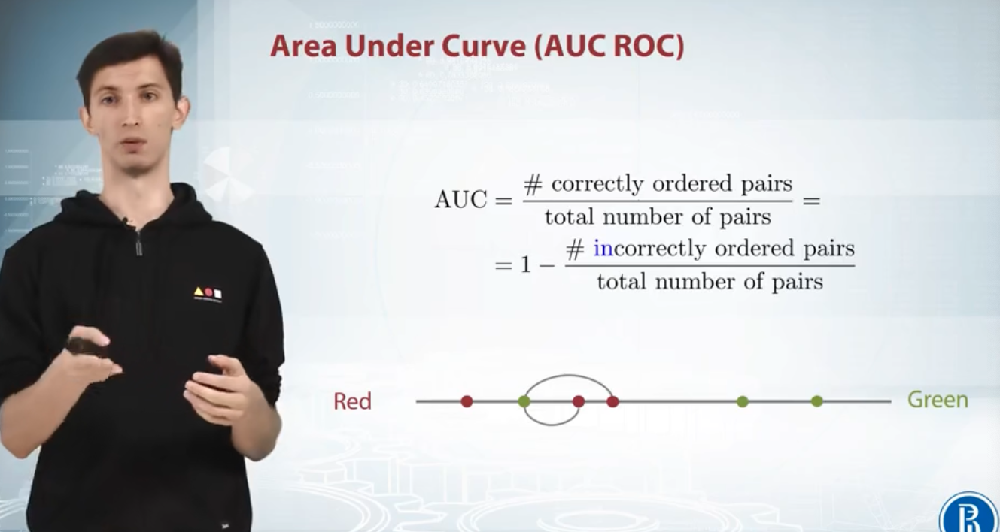

### 2.5 Cohen's Kappa

Baseline: if we have 20 cat labels and 80 dog labels, baseline would be 0.2\*0.1 + 0.8\*0.9 = 0.74

  

+ Weighted error -> Quadratic and Linear Weighted Kappa
+ Usually be used as: how much the predictions of the model agree with ground-truth raters -> how much does the model agree with professional doctors

  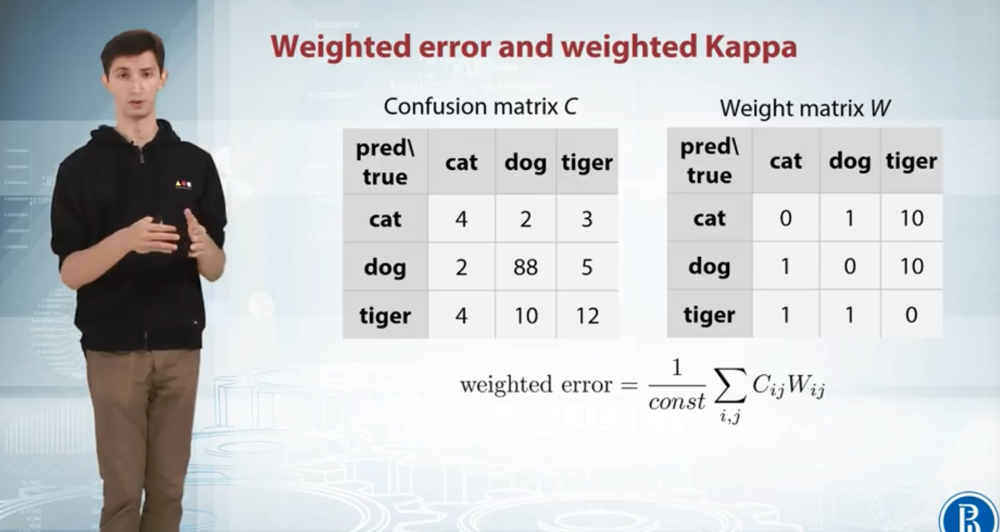
  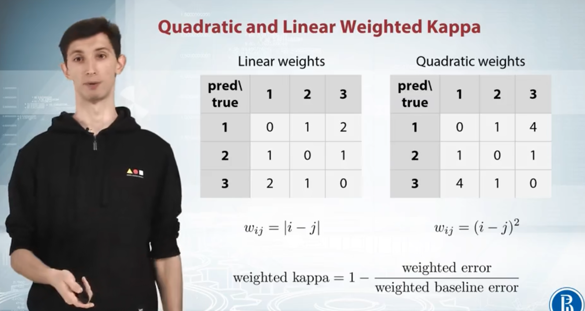

## 3 Metrics Optimization

### 3.1 Introduction

+ Target metric: what we want to optimize
+ Optimization loss: what model optimizes

  

### 3.2 Approaches

1. Just run the right model! -> MSE, logloss
  + Find the best model by setting the loss function to be these metrics
2. Preprocess train and optimize another metric -> MSPE, MAPE, RMSLE, ...
  + Cannot be used directly -> preprocess the data to fit the model which can use these metrics: XGBoost can not optimize MSPE, but we can change the train set to make XGBoost optimize MSE
3. Optimize another metric -> Accuracy, Kappa
  + Postprocess predictions
4. Optimize other metrics
  + Early stopping
4. Write custom loss function
  + Example:

  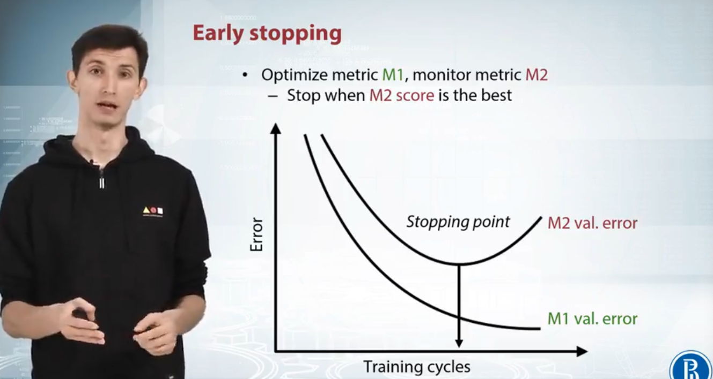
  

### 3.3 RMSE, MSE, R2

+ Left: libraries that support **MSE** optimization
+ Right: libraries that support **MAE** optimization

  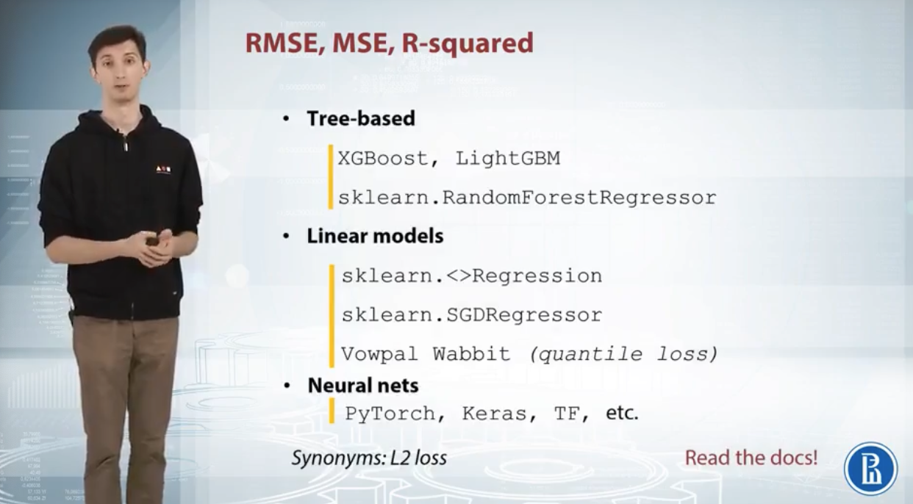
  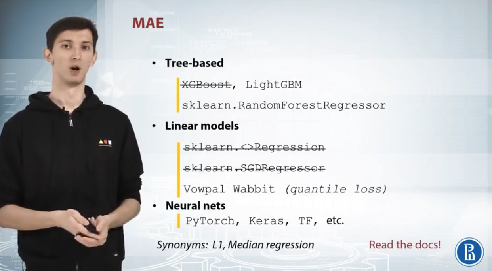

