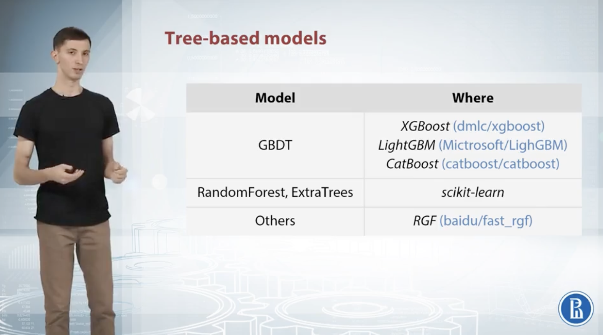
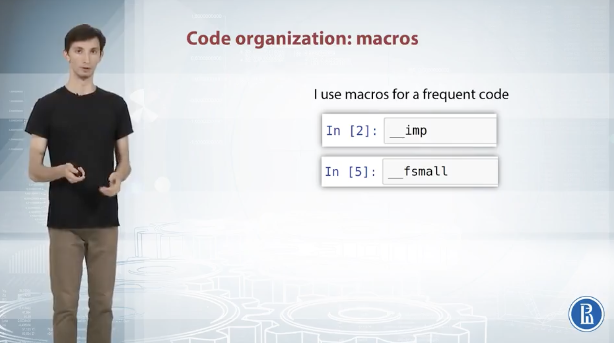
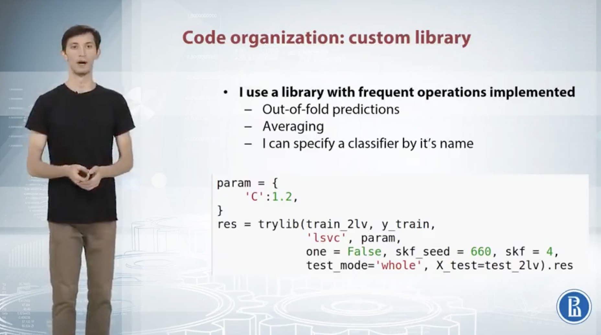
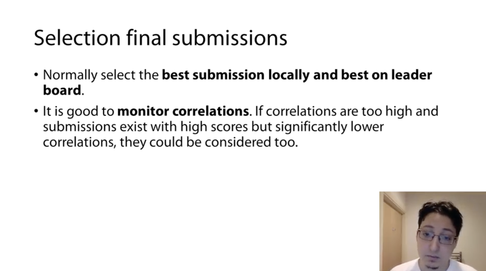
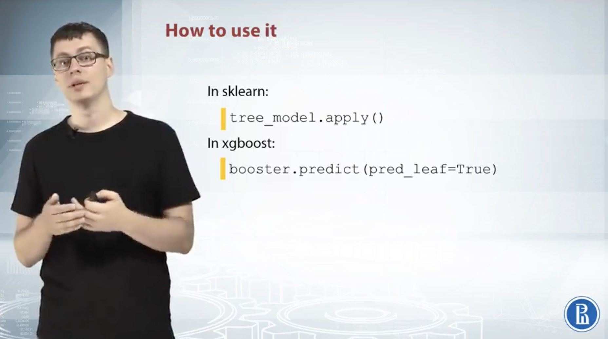

# Week 4

## 1 Hyperparameters Tuning

### 1.1 In General

1. Find out what parameters we should tune at first
2. How will the training and vlidation curves change after we increase or decrease the parameter
3. Manually / Automatically

  

### 1.2 How to Use The Libararies?

+ Define a function that will run our model
+ Specify a serach space

  
  

### 1.3 Color Coding Legend

1. Underfitting (Red)
2. Good fit and generalization
3. Overfitting (Green)

  

## 2. Hyperparameter Tuning

### 2.1 Tree-based Models

  

#### 2.1.1 GBDT

1. ***Max depth***: max depth of the tree
    + Deeper, better fit
    + If we get deeper and the model is not overfitting, the model will become better and better for validation set if we increase the depth
    + Alo implies that there might be a lot of important interactions to extract from the data -> stop tuning and doing some feature generations
    + Recommended value: 7
2. ***Subsample***: controls a fraction of objects to use when feeding a tree
    + Prevent from overfitting
3. ***colsample_bytree***, ***colsample_bylevel***: controls a fraction of features
    + Prevent from overfitting
4. ***min_child_weight***, ***lambda***, ***alpha***: regularization parameters
    + min_child_weight: increase it, the model will be more conservative; decrease it, the model will be less constrained
    + Recommend values: 0, 5, 15, 300
5. ***eta***: (not for tree, but for training): a learning weight, like in graident descent
    + Higher learning rate: not converge -> small enough learning rate -> better generalization
    + Too small learning rate: will learn nothing
6. ***num round***: (not for tree, but for training): how many learning steps we want to perform (how many trees we want to build)
    + More steps, better fit
    + Early stopping
    + When we find the right number of round: multiply the number of rounds by alpha, and devide eta by alpha
7. ***seed*** (other)

  

#### 2.1.2 Radnom forest and extra trees
1. ***n_estimator***:
    + Recommended: 10
    + Higher, better
2. ***max_depth***: Can be set to None (unlimited)
    + Recommended value: 7 (but RF usually have higher depths than XGBoost)
3. ***max_features***: Similar to colsample in XGBoost
4. ***min_samples_leaf***: Similar to min_child_weight in XGBoost
5. ***criterion***: Standard for split
    + Gini or Entropy: try both and choose the better one
6. ***random_state*** (not for tree, but for training)
7. ***n_jobs***: (not for tree, but for training) number of cores you have

  

### 2.2 Neural Networks

1. ***Number of neurons per layer***: learn more decision boundaries
    + Overfit fast
    + Recommanded: start with 64 neurons
2. ***Number of layers***: same to neurons
    + Due to otpimization problem, the learning can stop to converge
    + Recommanded: start with 1 layer
    + First try to make both the training and validation learning curve go down; then find some configurations which leads to overfitting
3. ***Optimizer***:
    + Adapted optimizer, like Adam, is faster but may lead to more overfitting
4. ***Batch size***: 
    + Huge batch size leads to more overfitting
    + Recommended: 32 or 64 (overfitting, decrease; underfitting, increase)
    + Should not be too small: the gradient will be too noisy
5. ***Learning rate***:
    + Not too high and not too low
    + Recommended: start with 1, and then lower it
    + Have connection with batch size: multiply learning rate with alpha, the batch size could also be multiplied by alpha (too large batch size will lead to overfitting)
6. ***Regularization***:
    + Usually use Dropout as regularization
    + Where to add: usaully near or at the end of the output layer, but also okay to add dropout layers inside the network
    + Static dropout: 
        1. Make the first hidden layer huge
        2. Add random dropout (say 99%) between the input layer and first hidden layer

  
  

### 2.3 Linear Models

+ SVC / SVR
    + Vowpol: speed up the porcess (reading data row by row)
    + Hyperparamters, except C (inverse), increase and the model tend to become more overfitting
    + Recommended: start with small C, 10e-6 (multiplied by 10)
    + Try both L1 and L2

  
  

### 2.4 Summary and Tips

  

## 3 Pratical Guide

### 3.1 Type One

  
  

  
  

### 3.2 Type Two

  
  

  

### 3.3 Type Three

  
  

  

### 3.4 Type Four

  
  

  
  

  
  

  
  

### 3.5 Type Five

  

  
  

  
  

  
  

  
  

  

## 4 Statistics and Distance Based Features

### 4.1 Group

+ Feature generation

  
  

+ Implementation

  

+ More features

  

### 4.2 Neighbors

+ Left: What if there is no features to use group by on? -> Replacing grouping operations with finding the nearest neighbors
+ Right: Example

  
  

+ Springleaf example

  
  

### 4.3 Matrix Factorizations for Feature Extraction

#### 4.3.1 Example 1: RecSys of movies

+ Based on the rating matrix R, form two matrices U, M for users and movies
+ U * M = R (approximately)

  
  

#### 4.3.2 Example 2: Documents/words example

+ Left: Dimensionality
+ Right: Apply matrix factorization to reduce dimension for each type of preprocessing texts, and combine the result to fit a tree based model

  
  

#### 4.3.3 Notes for matrix factorization

  
  

Need to use all parts of the data

  

### 4.4 Feature Interactions

Example: banner selection

  

#### 4.4.1 Approach one

Join + one-hot encoding

  

#### 4.4.2 Approach two

One-hot encoding + matrix multiplication

  

#### 4.4.3 Feature operations

+ Multiplication
+ Sum
+ Diff
+ Division

If we find feature interactions, there will be a lot of columns -> either feature selection or dimensionality reduction

  
  

#### 4.4.4 Interactions order

  

#### 4.4.5 Extract features from DT

  
  

### 4.5 tSNE

Non-linear methods of dimensionality reduction - manifold learning

  

#### 4.5.1 EDA

Example: tSNE and MNIST

Perplexity

  
  

#### 4.5.2 Obtain New Features

Concatenate transformers coordinates to the original feature matrix

  
  

## 5 Ensemble Modeling

  

