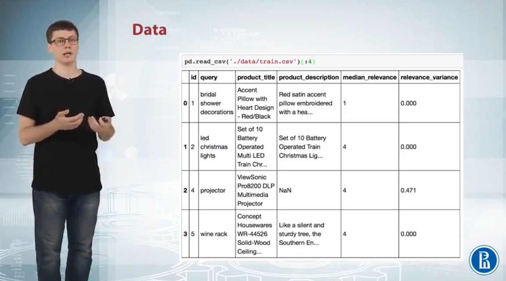
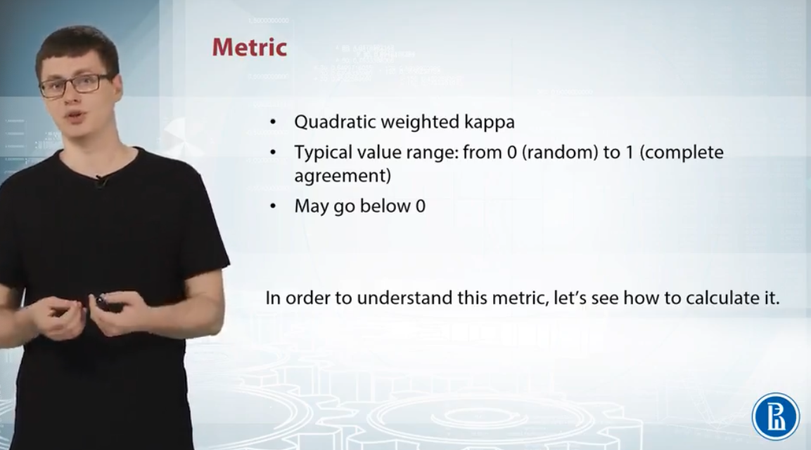
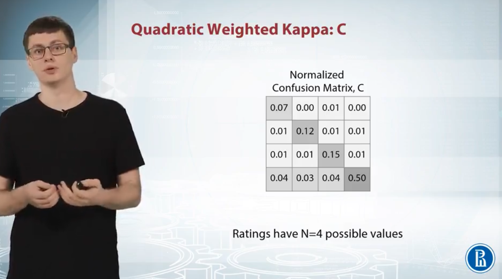
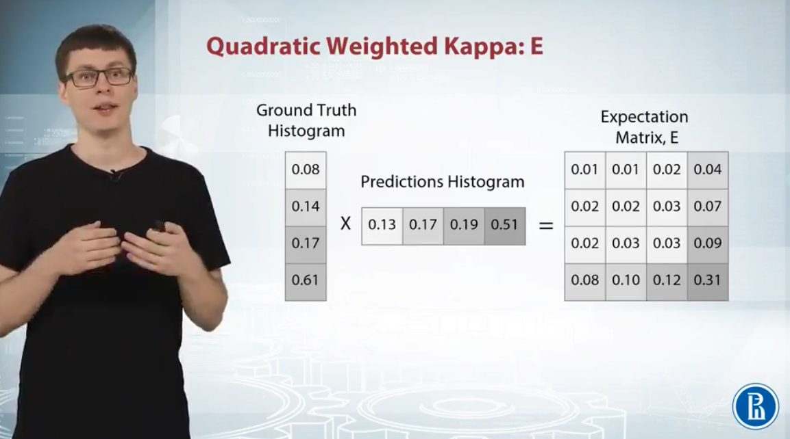
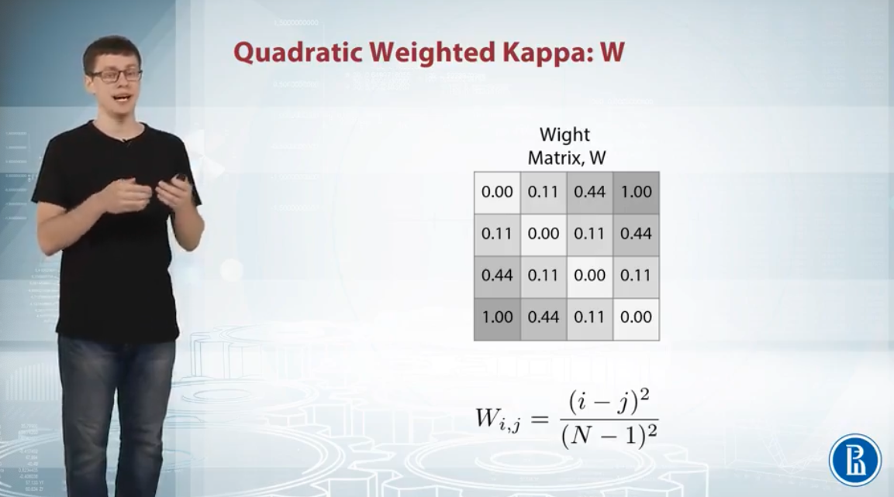

# Week 5

## 1 Crowdflower Competition Analysis

### 1.1 Problem Formulation

- Measure the accuracy of search results
- Predict the relevance score of a given query and problem description

  

### 1.2 Data

  

### 1.3 Metric

- Measure the agreement between two outcomes
- 0 (totally disagree) ~ 1 (totally agree); below 0 (less agreement between the raters than expected by random)

  

- How to calculate Quadratic Weighted Kappa?

  
  

  
  

### 1.4 Basic Solution

### 1.5 Advanced Features and Tricks
