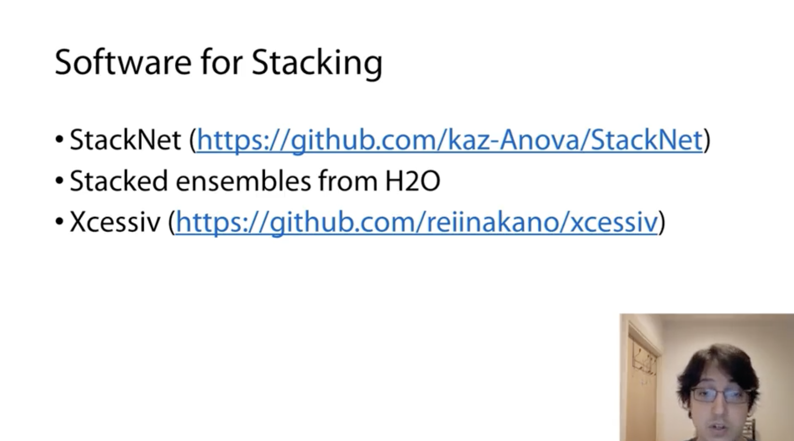
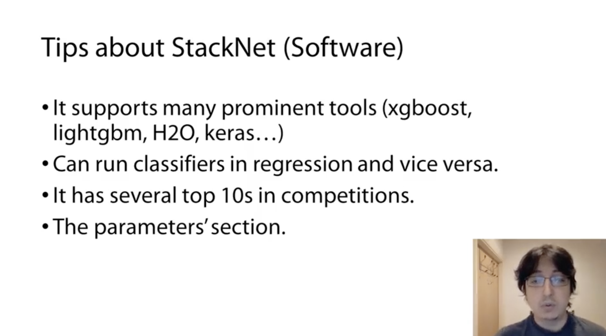

# Week 5

## 1 Crowdflower Competition Analysis

  
  

### 1.1 Problem Formulation

- Measure the accuracy of search results
- Predict the relevance score of a given query and problem description

### 1.2 Data

### 1.3 Metric

### 1.4 Basic Solution

### 1.5 Advanced Features and Tricks
