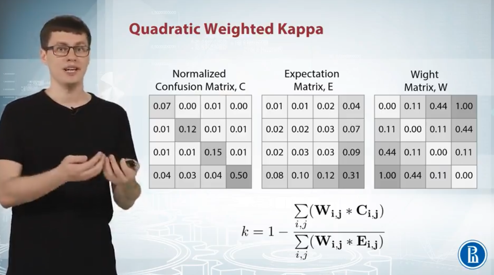
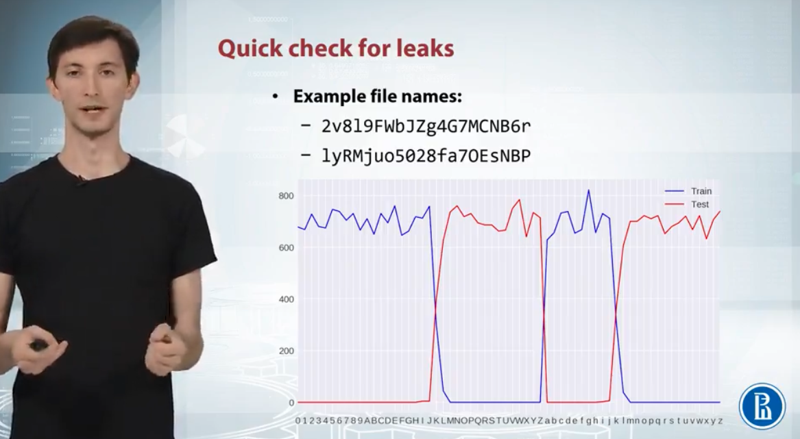

# Week 5

## 1 Crowdflower Competition Analysis

### 1.1 Problem Formulation

- Measure the accuracy of search results
- Predict the relevance score of a given query and problem description

  

### 1.2 Data

  

### 1.3 Metric

- Measure the agreement between two outcomes
- 0 (totally disagree) ~ 1 (totally agree); below 0 (less agreement between the raters than expected by random)

  

- How to calculate Quadratic Weighted Kappa?

  
  

  
  

### 1.4 Solutions

- Text feature
- Extending of queries
- Per-query models
- Sample weighting
- Bumper features
- Ensemble
- Kappa optimization

#### 1.4.1 Text features: similarities

- Standard measurements

  

- Symbolic n-grams

  

#### 1.4.2 Extending of queries

- Observe 3 important points about data
  - Queries are very short
  - Number of unique queries is 261
  - Queries are the same in train and test
- Extend queries
  1. For each query, we get the most relevant corresponding items
  2. Join the words form the title of the relevant items and ten popular words

#### 1.4.3 Per-query model

- Train and test sets are the same -> opportunity to split the problem into many small subtasks
- For each query, we can build a separate model -> only predict relevance of corresponding items
- Fit 261 random forest classifiers

  

#### 1.4.4 Sample weighting

- Larger variance -> lower confidence -> lower weight
- The first approach is good; the second approach is time wasting and does not show a better performance

  

#### 1.4.5 Bumper features

- Predict multiple classes -> predict binary classes

  

#### 1.4.6 Ensemble

  
  

#### 1.4.7 Kappa optimization

  

### 1.5 Conclusion

  

## 2 Springleaf

EDA, mean encodings, and features based on nearest neighbors

### 2.1 Stacking scheme

  

### 2.2 0 Level: Feature Packs

- First two: basic dataset + preprocessed dataset -> remove duplicated features and edit some feature interaction based on scatter plots and correlations
- Third: mean-encoded all categroical features using cv loop
- Fourth: mean-encoded dataset to calculate features based on nearest neighbors, like
  - What is the least in closest object of class zero?
  - How many objects out of ten nearest neighbors belong to class one?

  

### 2.3 1 Level: Out-of-fold Predictions

- XGBoost
  - Meta features should be diverse
  - Each meta feature should bring new information about the target
- Neural network
  - StandardScaler + ranks + power transformation
  - Problem: huge outliers which skew network training results - ranks and power transformation

  
  

### 2.4 1 Level: Features

  

### 2.5 2 Level: Classifiers

- Prediction should be diverse

  

### 2.6 3 Level: Final

- Use the linear model as final output -> because a linear model is not inclined to overfitting

  

## 3 Microsoft Malware Classification Challenge

### 3.1 Problem description

- ~20000 program executables, each given in two forms:
  - HEX dump "bytes file"
  - IDA disassembly

  
  

- Evaluation metric: Logloss

  

- Examine the meta data: quick check for leaks
  - Train and test split is random

  

### 3.2 Feature extraction

- Feature 1: size of the files -> accuracy of 88%

  

- Feature 2: single bytes counts

  

- Feature 3: system calls (compile file)

  

- Feature 4: asm operators

  

- Feature 5: sections distribution (number of .text lines)

  

- Incoporating all features

  

- Feature 6: n-gram (4 & 10 grams)

  
  

- Entropy

  

### 3.3 Feature processing and selection

### 3.4 Models

### 3.5 Tricks
