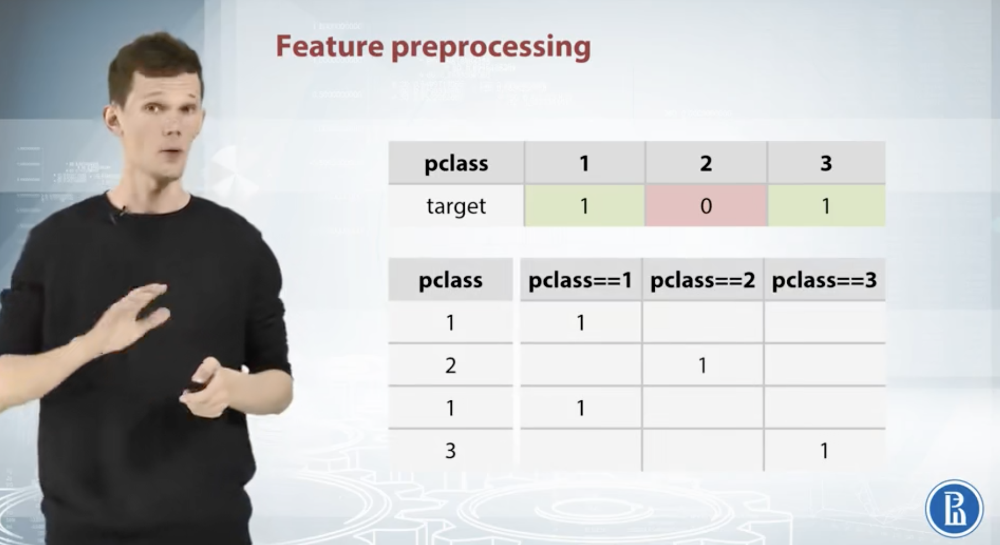
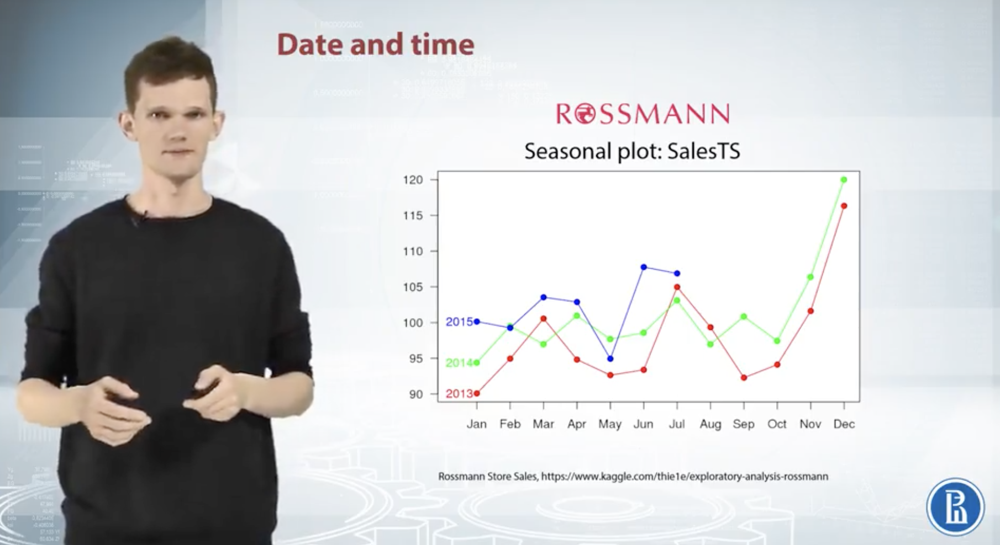

# How to Win a Data Science: Learn from Top Kagglers

# Week 1

## 1.1 Course Overview

### 1.1.1 Week 1

+ Intro to competitions & Recap
+ Feature preprocessing & extraction

### 1.1.2 Week 2

+ EDA
+ Validation
+ Data leaks

### 1.1.3 Week 3

+ Metrics
+ Mean-encoding

### 1.1.4 Week 4

+ Advanced features
+ Hpyerparameter optimization
+ Ensembles

### 1.1.5 Week 5

+ Final project
+ Winning solutions

## 1.2 Competitions Mechanics

+ Data
+ Model
+ Submission
+ Evaluation
+ Leaderboard

### 1.2.1 Data
仔细阅读官方提供的数据，判断是否进行特征筛选

### 1.2.2 Model
不是一个特定的算法，而是一个将数据转化为答案的过程。Model最好需要具有两个特性：
+ produce best possible prediction
+ Be reproducible

### 1.2.3 Submission
提交预测结果，注意最后提交文件格式

### 1.2.4 Evaluation
评估模型结果：通过不同的evaluation function（比如Accuracy，Logistic Loss，AUC，RMSE，MAE）

### 1.2.5 Leaderboard
分为Public Test Set和Private Test Set，后者用于比赛后的最终评价

### 1.2.6 总体比赛流程

  

## 1.3 Real World ML Pipeline
1. Understanding of business problem
2. Problem formalization
3. Data collecting
4. ***Data preprocessing***
5. ***Modelling***
6. Way to evaluate model in real life
7. Way to deploy model

## 1.4 Recap of ML Approach

Families of ML algorithms
+ Linear
+ Tree-based
+ KNN
+ Neural Networks

### 1.4.1 Linear model
本质思想：通过一条线划分空间为两个部分，对数据点进行分类（比如logistic regression和SVM）
+ 优点：
  1. Linear model对于稀疏高维数据（sparse high dimensional data）特别好
+ 缺点：
  1. 线性模型的普适性弱，大多数情况下点的分布会比较复杂
+ 实现：
  1. scikit-learn
  2. Vowpal Wabbit（专门用来处理大型数据）

### 1.4.2 Tree-based
模型：Decision Tree，Random Forest，GBDT
本质思想：通过不同标准分类点
+ 实现：
  1. scikit-learn
  2. XGBoost和LightGBM提高速度和准确性

### 1.4.3 KNN
本质思想：假设一点，然后找最近距离的几个点，然后修改假设点
+ 缺陷：
  1. 需要考虑到距离的计算公式，比如square distance不能捕捉语义
+ 实现：
  1. scikit-learn（包含所有距离函数，并且可以使用自己的距离公式）

### 1.4.4 Neural Networks
+ 实现：
  1. TensorFlow
  2. mxnet
  3. Pytorch
  4. Lasagne

### 1.4.5 Conclusion
1. There is no "silver bullet" algorithm
2. Linear models split space into 2 subspaces
3. Tree-based methods splits space into boxes
4. k-NN methods heavy rely on how to measure points "closeness"
5. Feed-forward NNs produce smooth non-linear decision boundary
6. The most powerful methods are ***Gradient Boosted Decision Trees*** and ***Neural Networks***

## 1.5 Hardware/Software requirement
+ Laptop（RAM、Cores、Storage）
+ Cloud resources（Amazon AWS、Microsoft Azure、Google Cloud）
+ Software（Language）：Python
+ Basic Stack：Numpy、Pandas、scikit-learn、matplotlib
+ IDE：IPython、Jupyter notebook
+ Special packages：XGBoost（提升决策树速度）、Microsoft/LightGBM（提升决策树速度）、Keras（用户友好的神经网络框架）、danielfrg/tsne
+ External tools：Vowpal Wabbit（大型数据计算）、srendle/libfm（优化器，适用于稀疏数据比如点击率预测）、guestwalk/libffm（同上）、baidu/fast_rgf

## 1.6 Featrue preprocessing and generation with respect to models

Main topics:
1. Feature preprocessing
2. Feature generation
3. Their dependence on a model type

Features: numeric, categorical, ordinal, datetime, coordinates

### 1.6.1 具体过程
**以[Titanic的数据集](https://www.kaggle.com/competitions/titanic/data)为例**

  

#### 判断数据类型
+ Survived: binary
+ Pclass: ordinal
+ Name: text
+ Sex: categorical
+ Age: numerical
+ SibSp: counts
+ Parch: counts
+ Ticket: ID
+ Fare: numerical
+ Cabin: cateborical
+ Embarked: categorical

比如Pclass，如果它是numerical，我们可以说第一类和第二类之间的差异等于第二类和第三类之间的差异，但是Pclass实际上是ordinal的，因为我们并不清楚两个差异是否相等。

为什么要这么做？
1. 模型和预处理高度相关
2. common feature generation methods

#### Feature preprocessing
假设一种情况：

  

pclass和目标之间很明显不是线性的情况，但如果我们要使用线性模型（随机森林在这种情况下会更好），就需要在某种程度上预处理pclass的数据，如下图：

  

#### Feature generation
假设对于一个苹果的销售，我们已经拥有过去两周的销售数据和一个大致的趋势。

  

如果我们决定使用线性模型，并且想要告诉模型这样的趋势，就需要添加一个feature来说明已经过去的周数（number of weeks passed）来让模型很好的找到linear dependency。

另一方面，如果考虑使用决策树，那么我们需要用到mean target value for each week这个特征。

  
  

**所以总结来说，无论是feature preprocessing还是generation，都是和所使用的模型高度相关（从模型到feature preprocessing的方式）。**

## 1.7 Numeric features
+ Preprocessing
  + Tree-based models
  + Non-tree-based models
+ Feature generation

  

### 1.7.1 Feature Preprocessing
#### a. Scaling
+ scaling对于KNN和linear都会造成影响；regularization和feature scaling是成正比的
+ gradient descent会受scaling的巨大影响
+ KNN中很重要

总结来说，不同模型所适用的scaling方法是不同的，或者可以说，选择scaling方法本身就是一个parameter needed to be optimized。

1. To [0,1]：distribution并没有变化

  
  

2. To mean = 0, std = 1

  

#### b. Outliers
对于线性模型来说，outlier是影响结果的重要因素

  

解决方式：设定upper bound和lower bound（比如1%和99%），被称为winsorization（极值调整）

#### c. Rank
基本思路：sets spaces between proper assorted values to be equal。对于有outlier的情况，rank的处理方式可能会好于MinMaxScaler，因为rank transformation可以将异常值更接近其他对象而不是忽略他们。

  

#### d. Other

  

### 1.7.2 Feature generation
Ways to proceed:
1. prior knowledge
2. EDA (Exploratory Data Analysis)

比如，根据面积和价格创建变量价格每平方米：

  

比如，根据纵向距离和横向距离创建直接距离：

  

比如，根据价格创建小数价格和整数价格：

  

**结论：**

  

## 1.8 Categorical and ordinal features

Ordinal features:
ordinal（有顺序的categorical）：

  

#### a. Label encoding
以embarked为例：

  

#### b. Frequency encoding
但如果出现频率相同，那么这个encoding方式将无法区别他们

  

#### c. One-hot encoding
特点：already sclaed；会减慢tree的速度并且并不会提升它的表现；如果类别较多，那么会有很多充满零的列

  

稀疏矩阵：在RAM中只存储非零的element，节省空间并且提高运算速度。
 可以通过将两个variable并行来进行one-hot encoding：

  

**总结：**

  

## 1.9 Datetime and coordinates
### 1.9.1 Date and time

#### a. Time moments in a period（当前时间）

Day number in week, month, season, year, second, minute, hour

#### b. Time passed since particular event

  

比如，对于销售量和Date来说，我们可以进行如下的feature generation：

  

#### c. Difference between date
datetime_feature_1 - datetime_feature_2

  
  

### 1.9.2 Coordinates

知道一个地点的坐标后，就可以得知其他相关地址或距离的信息，比如最近的医院、最近的超市、最近的车站：

  

如果是训练决策树的话，可以略微rotate coordinates as new features

  

**总结：**

  

## 1.10 Handling missing values
### 1.10.1 寻找missing value
missing value可能不是一个数字，可能是一个空字符串、-1、99等等。通过构建histogram来查找missing value（比如左边的histogram，-1很明显有很多重复值，所以-1可能为missing value）：

  

### 1.10.2 Fill NA approaches
1. -999, -1, etc
  + 优点：决策树可能会将其归为单独的类别
  + 缺点：linear model和神经网络会被影响
2. Mean, median
  + 优点：有利于linear model和神经网络
  + 缺点：决策树可能会很难选择有缺失值的observation
3. Reconstruct value
  1. 构建"isNull"特征：

  

  2. 如果是连续数据，则直接重构（不怎么出现这种情况）