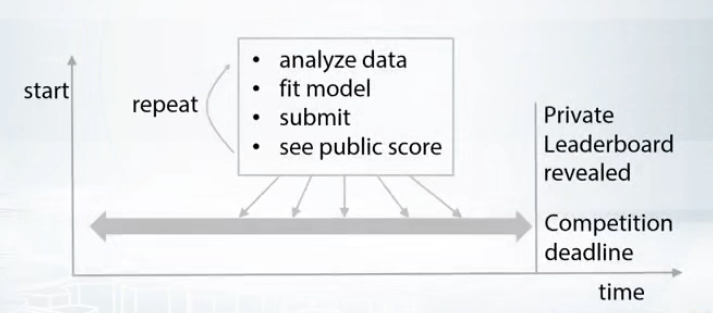

# How to Win a Data Science: Learn from Top Kagglers
Week 2

## 1 Exploratory Data Analysis

EDA最好的方式：visualization

1. Understand the data
  + Get domain knowledge（理解列名称、列之间的关系）
  + Check if the data is intuitive
   比如在下图的数据中，如果有click但没有impression其实是有问题，所以就创建一个新的column来判断数据是否正确

  + 