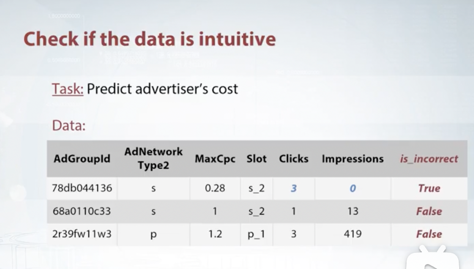
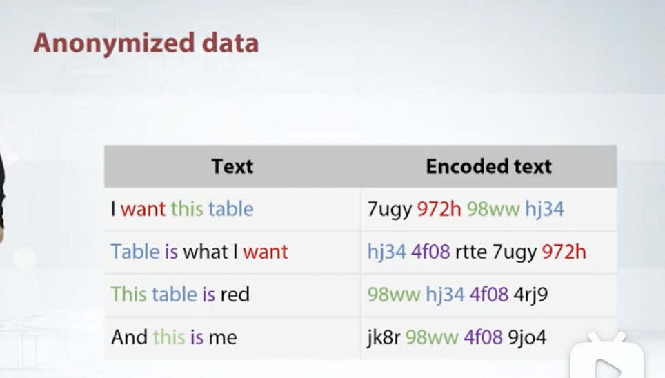
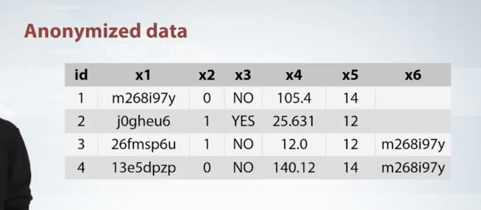
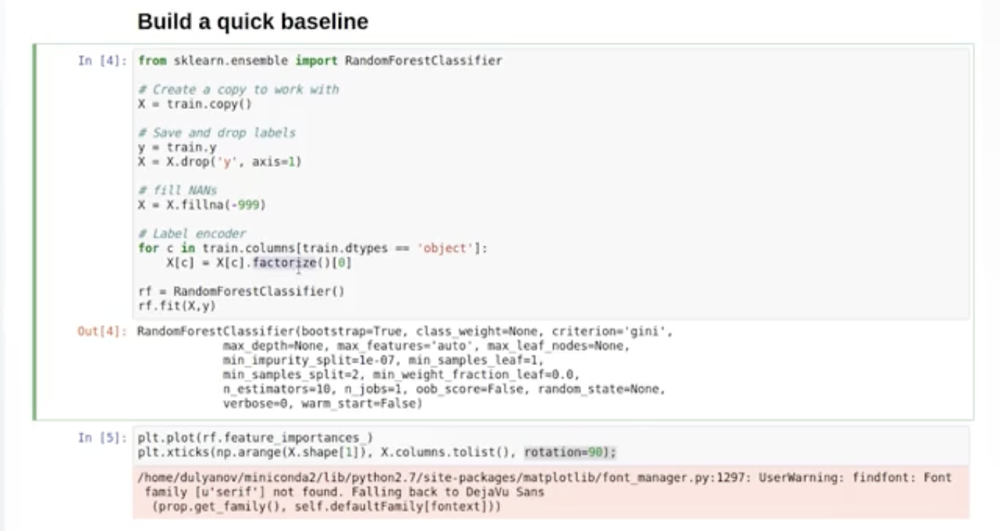
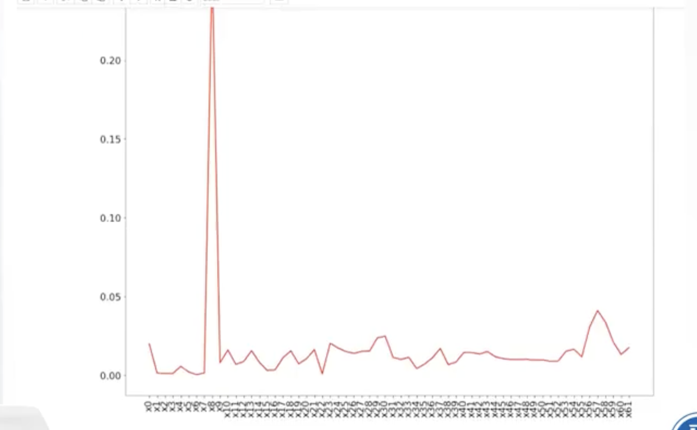
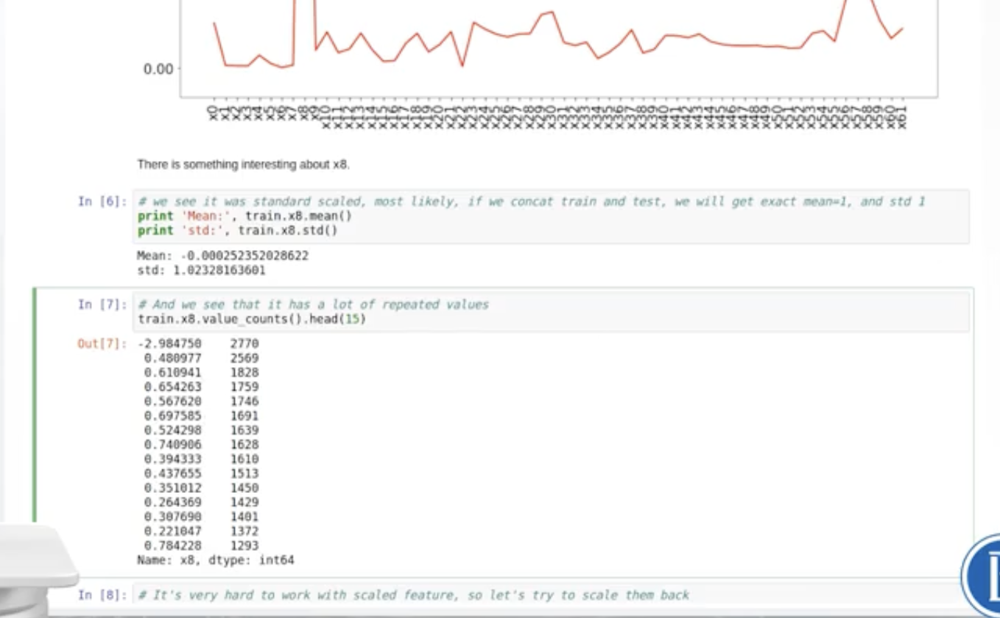
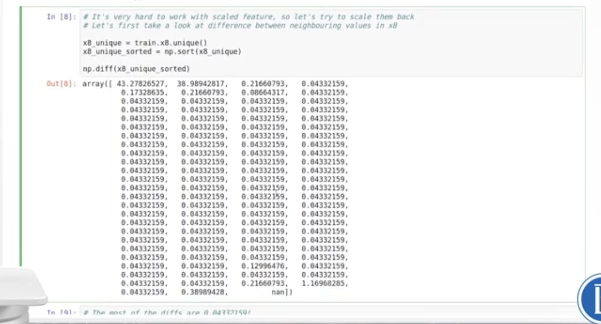
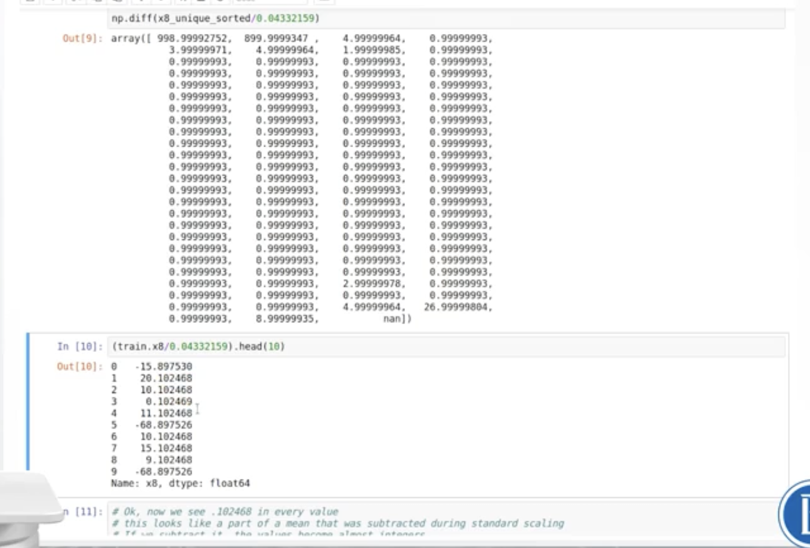
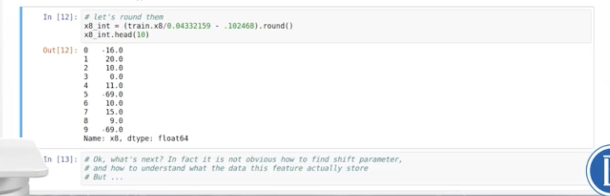
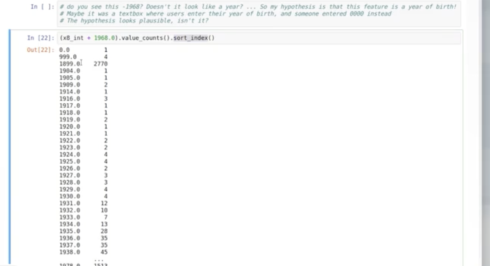

# How to Win a Data Science: Learn from Top Kagglers
Week 2

## 1 Exploratory Data Analysis

EDA最好的方式：visualization

## 2 Understand the data
  + Get domain knowledge:
   理解列名称、列之间的关系
  + Check if the data is intuitive:
   比如在下图的数据中，如果有click但没有impression其实是有问题，所以就创建一个新的column来判断数据是否正确

  + Understand how the data was generated:
   It is crucial to undersatnd the generation process to set up a proper validation scheme

## 3 Anonymized data
比如，text和encoded text的对比：

+ Explore individual features
  + Guess the meaning of the columns
  + Guess the types of the column
+ Explore feature relations
    + Find relaations between pairs
    + Find feature groups

### 3.1 举例
对于Anonymized data的处理
 使用随机森林对变量的重要性进行排序，x轴是变量名，y轴是变量的重要程度。
 我们可以从图中看出，**x8**似乎是一个很重要的变量。

然后我们深入挖掘这个变量：
1. 变量的mean和sd趋近于0和1，说明其趋向于正态分布，很有可能是公司赋予的值
2. 我们发现此变量的重复值很多，说明很有可能变量是被scale过了；要尝试将其scaled back（scale的方式是被multiple一个数，然后再加减一个数）
3. 为了寻找规律，我们获取这些数的distinct value，排序后对它们做差；我们发现这些差值都是一样的（但不代表就是这个差值，也可能是5、6、7）

4. 我们再把我们的数据除以0.43，就会发现差值都变成了1
5. 我们现在查看原数据除以0.43，发现正数的小数部分和负数的小数部分是一样的，说明数据被偏移了一个常量；我们将其近似还原，结果如下：

当我们把还原后的数据按照频率列出后，我们往下拉，看到一个-1968，说明这组数据很可能是一个文本框要求输入用户的年龄，出于某些原因有人输入了0进入；如果这个假设成立，那么年龄的baseline就是1968。

我们将还原数据加上1968，结果变成：

根据这个数据我们可以初步看出，年份集中分布在1970附近，1899多可能是因为这是系统的默认值，而999和0可能是一些非正常数据。

如果对于线性模型，我们可以添加一个新的变量比如age group之类的，但对于目前这个比赛意义不大。

### 3.2 类型分析
对于下面表格内的数据来说，我们还可以对每列进行类型分析：
+ x1是文字记录或是categorical data
+ x2和x3是binary
+ x4是numerical
+ x5是categorical或numerical（如果x5是numerical，它有可能是event calendar，因为数据类型是整数）

